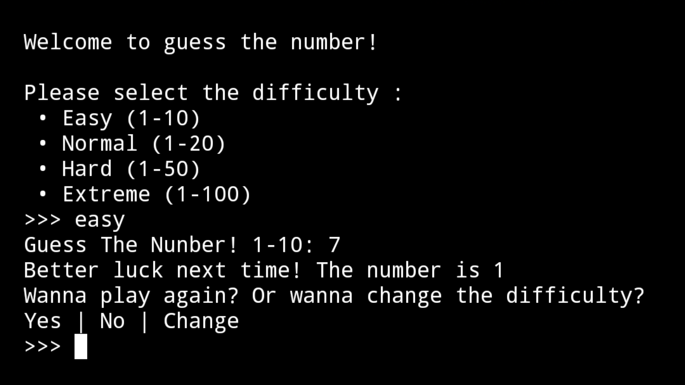

#  Guess The Number

**ZPP** (Zikri Practice Project) Series **II**


[](https://github.com/zikri-codes/Guess-The-Number-ZPP-II/blob/main/LICENSE)


---

##  Description
A simple terminal-based number guessing game written in Python.  
The player chooses a difficulty level and tries to guess the randomly generated number.  

---

##  Features
- **4** difficulty levels:  
  - **Easy** (1–10)  
  - **Normal** (1–20)  
  - **Hard** (1–50)  
  - **Extreme** (1–100)  
- Option to **play again, change difficulty, or quit.**
- Runs on **pure Python**, no external libraries required.  

---

##  How to Run
1. **Clone** this repository:
    ```bash
    git clone https://github.com/zikri-codes/Guess-The-Number-ZPP-II.git
    cd reponame
    ```
2. Run the script with **Python**:
    ```bash
    python guess-the-number.py
    ```

---

##  Screenshot



---

##  Project Structure

```
 guess-the-number.py   # Main game script
 LICENSE.txt           # MIT License
 README.md             # Project documentation
 screenshot.png        # Gameplay screenshot
```

---

##  License

This project is licensed under the **MIT License** - see the [LICENSE](https://github.com/zikri-codes/Guess-The-Number-ZPP-II/blob/main/LICENSE) file for details.

